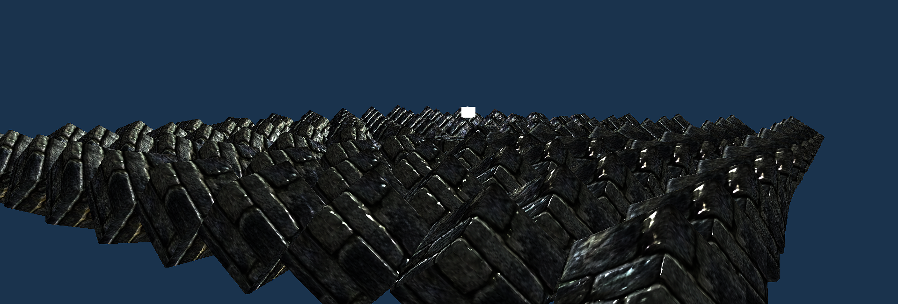
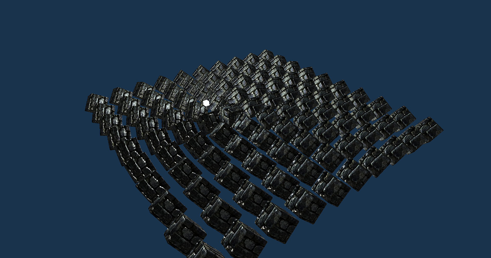

# BS Engine

## WIP

This is a 3d engine I am creating for learning experience and future use.
So far:
* Vertex and Index Buffers
* Textures
* Camera Controller like in FPS
* Instancing
* Model Loading
* Materials
* Lights
* Ambient Lighting
* Diffuse Lighting
* Normal Mapping
* AA

## Showcase

## To Do
* GUIS - Priority
* Event Handler - Priority
* More Clean Up
* Transparency
* Shadows
* Collision
* Rigidbodies